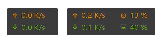

> 欢迎大家提交自己制作的皮肤，如果你想提交你制作的皮肤，请通过电子邮件发送到 zhongyang219@hotmail.com，邮件请注明“TrafficMonitor皮肤”。

**相关链接：**

皮肤编辑器：[点此下载](https://github.com/zhongyang219/TrafficMonitorSkinEditor/releases)

皮肤制作教程：[点击此处](https://github.com/zhongyang219/TrafficMonitor/wiki/%E7%9A%AE%E8%82%A4%E5%88%B6%E4%BD%9C%E6%95%99%E7%A8%8B)

**皮肤使用说明：**

下载皮肤zip压缩包后将其解压，把里面的皮肤文件夹放到TrafficMonitor主程序所在目录下\skins目录下即可。注意，文件夹里面不能有嵌套文件夹。添加了新的皮肤后需要重新启动软件。

----------

### 默认皮肤（简洁）

[点此下载](./skins/%E9%BB%98%E8%AE%A4%E7%9A%AE%E8%82%A4%EF%BC%88%E7%AE%80%E6%B4%81%EF%BC%89.zip?raw=true)

**皮肤09（简洁）**

[点此下载](./skins/%E7%9A%AE%E8%82%A409%EF%BC%88%E7%AE%80%E6%B4%81%EF%BC%89.zip?raw=true)

### 皮肤10（竖排）

[点此下载](./skins/%E7%9A%AE%E8%82%A410%EF%BC%88%E7%AB%96%E6%8E%92%EF%BC%89.zip?raw=true)

### 春意

[点此下载](./skins/%E6%98%A5%E6%84%8F.zip?raw=true)

### 皮肤11

[点此下载](./skins/%E7%9A%AE%E8%82%A411.zip?raw=true)

### 皮肤11 (2)

.png)

[点此下载](./skins/%E7%9A%AE%E8%82%A411%20(2).zip?raw=true)

### 360悬浮窗

[点此下载](./skins/360%E6%82%AC%E6%B5%AE%E7%AA%97.zip?raw=true)

### 360悬浮窗dark

[点此下载](./skins/360悬浮窗dark.zip?raw=true)

### 金山悬浮窗

[点此下载](./skins/%E9%87%91%E5%B1%B1%E6%82%AC%E6%B5%AE%E7%AA%97.zip?raw=true)

### 金山悬浮窗 (2)

.png)

[点此下载](./skins/%E9%87%91%E5%B1%B1%E6%82%AC%E6%B5%AE%E7%AA%97%20(2).zip?raw=true)

### LT01

皮肤作者：[LT](https://github.com/zuilintan)

[点此下载](./skins/LT01.zip?raw=true)

### Block

皮肤作者：PatZer0

[点此下载](./skins/Block.zip?raw=true)

### EsnPc

EsnPc_Dark

EsnPc_Light

皮肤作者：YeYo（EsnPc.CoM）

[点此下载](./skins/EsnPc.zip?raw=true)

### YuLu

YuLu_Dark

YuLu_Light

[点此下载](./skins/YuLu_Skin.zip?raw=true)

### 现代悬浮球

皮肤作者：[暗巷潜光](https://github.com/1247343406/A-TrafficMonitor-s-modern-skin)

[点此下载](./skins/现代悬浮球.zip?raw=true)

### 新现代悬浮球

皮肤作者：[暗巷潜光](https://github.com/1247343406/A-TrafficMonitor-s-modern-skin)

[点此下载](./skins/新现代悬浮球v3.0.1.zip?raw=true)

### 流萤

皮肤作者：CommandPrompt-Wang

[点此下载](./skins/流萤.zip?raw=true)

### 火绒悬浮窗

皮肤作者：black-06

[点此下载](./skins/火绒悬浮窗.zip?raw=true)
